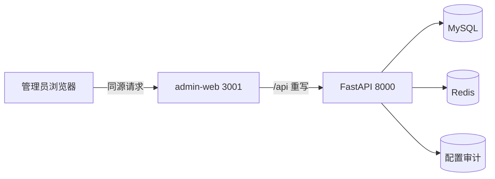

# zeroAgent 独立管理后台设计

> 状态：已确认（作为 PRD v0.8.0 补充依据）
> 日期：2026-07-29
> 作者：赵振明
> 关联：`docs/01-产品需求/PRD.md`、`docs/superpowers/specs/2026-07-29-memory-extract-whitelist-design.md`、`docs/superpowers/specs/2026-07-29-l2-negation-catalog-design.md`

## 1. 设计目标

为 zeroAgent 增加面向平台管理员与超级管理员的独立管理后台，集中治理运行时高频配置。首期真实交付以下闭环：

1. 记忆抽取字段白名单管理；
2. 规则漏斗 L2 关键词管理；
3. L2 规则服务端无副作用试跑；
4. 两类配置变更审计；
5. 管理后台概览、登录、权限拦截、明暗双主题；
6. 其余规划能力仅提供统一菜单骨架和“规划中”页面。

管理后台采用左侧固定侧边栏、顶部固定导航栏、右侧主内容区三段式布局。视觉定位为“企业级未来科技”，酷炫但不牺牲表格密度、可读性、可访问性和运维效率。

## 2. 已确认的产品裁定

| 维度 | 裁定 |
|---|---|
| 项目形态 | 同一仓库新增独立前端项目 `admin-web/`，不改造员工端 `web/` |
| 首期完整度 | 全量菜单骨架；概览、白名单、L2、相关审计真实可用 |
| 配置生效 | 保存即生效：MySQL 成功后刷新 Redis |
| 主题 | 明亮、暗黑双主题，并支持跟随系统 |
| 白名单停用 | 历史记忆保留，但停止后续抽取并立即停止对话注入；重新启用后恢复使用 |
| L2 验证 | 提供后端现行规则的真实试跑，不产生对话、记忆或审计之外的业务副作用 |
| 系统种子 | 可编辑、可停用、不可永久删除，可一键恢复默认值 |
| 配置审计 | 本期记录并可查询操作人、时间、动作、变更摘要、结果与请求标识 |

## 3. 现状与缺口

### 3.1 已有能力

后端已具备两组基础管理接口：

- `/api/v1/memory/extract-fields`：记忆抽取字段分页、创建、更新、软删、缓存重载；
- `/api/v1/intent/l2-keywords`：L2 关键词分页、创建、更新、软删、缓存重载。

两类配置均采用 MySQL 真相源、Redis 运行时热读、代码种子降级的治理模式。员工端已经存在 `web/`，技术栈为 Next.js 15、React 19、TypeScript。

### 3.2 本设计需要补齐

1. 独立管理员前端及三段式布局；
2. 会话身份查询和严格管理员准入；
3. 系统种子稳定标识、恢复默认值与删除保护；
4. L2 服务端试跑接口；
5. 配置变更审计与审计查询；
6. 配置缓存健康状态与部分成功反馈；
7. 并发编辑冲突保护；
8. 现行产品需求文档对独立管理端的正式裁定。

## 4. 工程架构

### 4.1 仓库布局

```text
zeroAgent/
├── web/                    # 员工端，默认端口 3000
├── admin-web/              # 新增管理后台，默认端口 3001
├── src/app/                # FastAPI，默认端口 8000
├── tests/                  # 后端测试
└── docs/                   # 产品、架构与实施文档
```

新增的是独立应用，不是独立仓库。员工端和管理端可独立构建、部署、扩缩容与回滚，但共享后端认证、业务接口和同一账号体系。

### 4.2 前端选型

| 维度 | 选型 |
|---|---|
| 框架 | Next.js 15 App Router + React 19 + TypeScript 严格模式 |
| 组件库 | Ant Design 5，使用主题令牌统一明暗模式 |
| 图标 | `@ant-design/icons`，关键状态必须“图标 + 文案”，禁止只靠颜色 |
| 样式 | CSS Modules 或局部样式表 + 全局设计令牌；不复制员工端超长全局样式 |
| 数据请求 | 统一类型化请求封装；经 Next.js 同源重写代理 FastAPI |
| 表单 | Ant Design Form；前后端双重校验 |
| 测试 | Vitest + Testing Library；关键管理闭环使用 Playwright |

首期概览以指标卡和状态列表为主，不引入复杂图表依赖。后续新增趋势图时，再按统一可视化规范接入。

### 4.3 请求链路



管理端不保存令牌或数据库凭据。登录成功后使用后端 HttpOnly Session Cookie；生产环境启用 Secure、SameSite 与跨站请求防护。

## 5. 信息架构与菜单

### 5.1 一级菜单

| 分组 | 菜单 | 路由 | 本期状态 |
|---|---|---|---|
| 总览 | 控制台概览 | `/overview` | 可用 |
| 智能体 | Agent 管理 | `/agents` | 规划中 |
| 智能体 | 模型与服务商 | `/models` | 规划中 |
| 智能体 | Prompt 模板 | `/prompts` | 规划中 |
| 知识与编排 | 知识库 | `/knowledge` | 规划中 |
| 知识与编排 | 工作流 | `/workflows` | 规划中 |
| 知识与编排 | 知识图谱 | `/knowledge-graph` | 规划中 |
| 系统治理 | 记忆抽取白名单 | `/system/memory-fields` | 可用 |
| 系统治理 | L2 关键词规则 | `/system/l2-keywords` | 可用 |
| 系统治理 | 敏感词 | `/system/sensitive-words` | 规划中 |
| 组织权限 | 用户管理 | `/organization/users` | 规划中 |
| 组织权限 | 角色权限 | `/organization/roles` | 规划中 |
| 运维审计 | 用量与成本 | `/operations/usage` | 规划中 |
| 运维审计 | 配置审计 | `/operations/audit` | 可用，仅覆盖本期两类配置 |
| 运维审计 | 通知与告警 | `/operations/alerts` | 规划中 |

规划中页面统一展示功能目标、计划能力和返回概览入口，不渲染伪造数据，不提供不可用按钮。

### 5.2 导航行为

- 侧边栏按分组展示，支持折叠；折叠状态本地保存；
- 顶部栏展示面包屑、主题切换、通知占位、当前管理员与退出；
- 当前路由在侧边栏高亮，父分组自动展开；
- 管理端首页固定跳转 `/overview`；
- 未登录跳转 `/login`；角色不符进入独立 403 页面，不循环跳转；
- 不将管理菜单渲染到员工端 `web/`。

## 6. 三段式布局

### 6.1 桌面端

| 区域 | 规格 |
|---|---|
| 左侧栏 | 固定定位；展开 248 像素、折叠 72 像素；独立滚动 |
| 顶部栏 | 固定定位；高度 64 像素；位于侧边栏右侧 |
| 主内容区 | 位于顶部栏下方；独立纵向滚动；左右留白随视口缩放 |
| 内容宽度 | 表格类页面流式铺开，最大 1600 像素；表单抽屉宽 520～640 像素 |

### 6.2 小屏适配

- 视口小于 1024 像素时，侧边栏改为抽屉；
- 顶部栏保留主题、用户和菜单入口，次要文字隐藏；
- 表格保留关键列，其余列进入详情抽屉；
- 可操作控件触摸目标不小于 40×40 像素；
- 首期桌面优先，但不能出现横向页面级溢出。

## 7. 视觉与双主题

### 7.1 视觉语言

- 暗黑主题：深空蓝黑底、青色与蓝绿色光晕、半透明导航面板、细边框；
- 明亮主题：冷白与浅蓝灰底、白色实体内容面板、青蓝强调色；
- 玻璃拟态仅用于侧边栏、顶部栏、概览头部，不用于高密度表格和弹窗；
- 背景可使用低对比网格与静态光晕，禁止持续粒子动画干扰运维操作；
- 动效时长 160～240 毫秒；遵循 `prefers-reduced-motion`。

### 7.2 核心令牌

| 角色 | 明亮主题 | 暗黑主题 |
|---|---|---|
| 页面底色 | `#F4F7FB` | `#070B14` |
| 一级面板 | `#FFFFFF` | `#0F172A` |
| 二级面板 | `#F8FAFC` | `#111C2E` |
| 主文字 | `#0F172A` | `#F8FAFC` |
| 次文字 | `#64748B` | `#A8B3C7` |
| 边框 | `#DCE4EF` | `#25324A` |
| 主强调 | `#0F766E` | `#22D3EE` |
| 次强调 | `#2563EB` | `#2DD4BF` |
| 焦点环 | `#0284C7` | `#38BDF8` |

状态色采用固定角色，不随主题交换语义：成功、警告、严重、失败均配套图标和文字。状态文字不得直接使用低对比黄色或橙色作为唯一表达。

### 7.3 主题切换

提供“跟随系统 / 明亮 / 暗黑”三态选择，偏好写入浏览器本地存储。首次访问默认跟随系统；服务端首屏注入主题脚本，避免主题闪烁。两套主题分别定义令牌，不做简单颜色反转。

## 8. 控制台概览页

首期不做趋势折线图，使用可直接读取的指标卡和状态面板：

1. 已启用记忆字段数；
2. 已启用 L2 关键词数；
3. 两类缓存同步状态；
4. 最近 24 小时配置变更数；
5. 快捷入口：新增记忆字段、新增 L2 关键词、规则试跑、缓存重载；
6. 最近配置审计列表，最多展示 8 条。

指标卡展示当前值、状态标签与说明，不用单柱图或饼图伪装单个数字。加载刷新时保留原布局，避免骨架屏反复跳动。

## 9. 记忆抽取白名单页面

### 9.1 页面结构

1. 页面标题、运行说明与缓存状态；
2. 顶部指标卡：总数、启用数、停用数、三种类别数量；
3. 筛选栏：关键字、类别、状态、来源；
4. 主表格；
5. 新增/编辑抽屉；
6. 缓存重载与恢复默认操作。

### 9.2 表格字段

| 字段 | 说明 |
|---|---|
| 名称 | 中文展示名 |
| 字段键 | `field_key`，等宽字体展示 |
| 类别 | 事实 / 偏好 / 摘要 |
| 描述 | 注入抽取提示词的业务说明 |
| 状态 | 启用 / 停用 |
| 优先级 | 数字越小越靠前 |
| 来源 | 系统默认 / 自定义 |
| 更新时间 | 使用统一时区展示 |
| 操作 | 编辑、启停、恢复默认、软删 |

### 9.3 编辑规则

- 类别固定为 `fact`、`preference`、`summary`；
- 自定义 `field_key` 必须满足 `^[a-z][a-z0-9_]{0,63}$`；
- `field_key` 创建后不可修改，避免已有记忆失去归属；
- 同一 `field_key` 不允许重复；
- 系统种子允许修改名称、描述、状态和优先级，但不允许删除；
- 自定义项允许软删；软删前二次确认；
- 停用或删除后：历史记忆保留，但运行时不再抽取或注入；
- 恢复系统默认值必须展示将被覆盖的字段并二次确认。

## 10. L2 关键词规则页面

### 10.1 页面结构

1. 页面标题、规则匹配顺序说明与缓存状态；
2. 分类统计卡；
3. 筛选栏：关键词、分类、匹配方式、状态、来源；
4. 关键词表格；
5. 新增/编辑抽屉；
6. 在线命中测试面板；
7. 缓存重载与恢复默认操作。

### 10.2 固定分类

| 分类 | 中文名 | 目标行为 |
|---|---|---|
| `explicit_kb` | 显式查库 | `kb_lookup` |
| `leave` | 请假表达 | `ask_user_form` |
| `meta_reply` | 纠正与元追问 | `chitchat` |
| `doc_dump` | 文档全文 | `doc_analyze:dump` |
| `doc_summarize` | 文档总结 | `doc_analyze:summarize` |
| `doc_critique` | 文档审查 | `doc_analyze:critique` |
| `person_search_verb` | 人物检索动作 | 与姓名结构组合后进入 `kb_lookup` |

首期不允许新增分类，不允许配置正则表达式。

### 10.3 编辑规则

- 匹配方式仅允许：包含、全等、前缀；
- 关键词去除首尾空白后长度为 1～128；
- 同一分类下关键词不可重复；
- 优先级越小越先匹配；
- 系统种子可编辑、停用、恢复，不可删除；
- 自定义词条可软删；
- 保存成功即进入运行目录；缓存失败时必须明确显示“数据库已保存、缓存未同步”。

### 10.4 服务端真实试跑

测试面板支持输入一条语句并选择：

1. 使用当前已生效目录测试；
2. 带上当前编辑抽屉中的未保存候选规则测试。

返回并展示：漏斗层级、最终意图、置信度、原因、命中分类、命中短语、匹配方式、优先级。未命中时明确显示“L2 未命中，将继续进入 L3”，不得假装给出 L3 结果。

试跑不得创建对话、消息、记忆、审批或业务任务；只记录一条轻量管理审计。

## 11. 配置审计页面

### 11.1 本期范围

仅查询以下资源：

- `memory_extract_field`；
- `intent_l2_keyword`；
- 配置缓存重载；
- 系统种子恢复；
- L2 规则试跑。

### 11.2 审计字段

| 字段 | 说明 |
|---|---|
| 时间 | 服务端时间，界面按东八区显示 |
| 操作人 | 用户标识、用户名、角色 |
| 动作 | 创建、更新、启用、停用、删除、恢复、重载、试跑 |
| 资源 | 类型、资源标识、显示名 |
| 变更摘要 | 变更前后差异；列表只展示摘要，详情抽屉展示结构化差异 |
| 结果 | 成功、部分成功、失败 |
| 请求标识 | 用于日志关联 |
| 来源地址 | 脱敏后的客户端地址，可选展示 |

审计记录不可通过管理后台修改或删除。分页、筛选和详情查询均由后端完成。

## 12. 配置写入与一致性

### 12.1 保存流程

```text
校验请求与管理员权限
  → 读取旧值并校验修订号
  → 同一数据库事务写配置与审计记录
  → 提交 MySQL
  → 全量刷新对应 Redis 目录并递增版本
  → 返回配置、缓存同步状态、目录版本、请求标识
```

MySQL 与 Redis 无法组成单一事务，因此接口必须如实返回三种结果：

1. 成功：数据库和缓存均成功；
2. 部分成功：数据库成功、缓存失败；
3. 失败：数据库未提交。

部分成功时，界面显示常驻警告和“立即重试缓存同步”按钮，不得仅弹出一闪而过的提示。

### 12.2 并发编辑

配置响应增加 `revision` 或等价修订标识。更新请求必须携带读取时的修订号；若已被他人修改，返回 409，并展示“重新加载后比较差异”，禁止静默覆盖。

## 13. 后端契约增量

### 13.1 认证与概览

| 方法 | 路径 | 用途 |
|---|---|---|
| GET | `/api/v1/auth/me` | 返回当前会话用户与角色；未登录 401 |
| POST | `/api/v1/auth/logout` | 清理会话 |
| GET | `/api/v1/admin/overview` | 返回两类配置计数、缓存状态、最近审计摘要 |

### 13.2 记忆白名单

保留已有接口，并增加：

| 方法 | 路径 | 用途 |
|---|---|---|
| POST | `/api/v1/memory/extract-fields/{id}/reset-default` | 系统种子恢复默认 |
| GET | `/api/v1/memory/extract-fields/cache-status` | 目录版本与降级状态 |

更新、删除、恢复均返回 `cache_synced`、`catalog_version` 与 `request_id`。

### 13.3 L2 关键词

保留已有接口，并增加：

| 方法 | 路径 | 用途 |
|---|---|---|
| POST | `/api/v1/intent/l2-keywords/test` | 当前目录或候选规则无副作用试跑 |
| POST | `/api/v1/intent/l2-keywords/{id}/reset-default` | 系统种子恢复默认 |
| GET | `/api/v1/intent/l2-keywords/cache-status` | 目录版本与降级状态 |

### 13.4 审计

| 方法 | 路径 | 用途 |
|---|---|---|
| GET | `/api/v1/audit-logs` | 分页与条件查询 |
| GET | `/api/v1/audit-logs/{id}` | 查看结构化变更详情 |

## 14. 数据模型增量

### 14.1 配置来源与默认恢复

两张配置表增加等价字段：

- `origin`：`system` 或 `custom`；
- `seed_code`：系统种子的稳定标识，自定义项为空；
- `revision`：乐观锁修订号；
- `created_by`、`updated_by`：操作者标识。

`seed_code` 不随管理员修改展示值而改变。恢复默认时根据代码内版本化种子映射恢复，不依赖管理员修改后的关键词或标签反查。

### 14.2 配置审计表

新增通用配置审计表，至少包含：

- 审计标识、操作人、角色；
- 动作、资源类型、资源标识；
- 变更前、变更后或结构化差异；
- 结果、错误摘要、请求标识；
- 客户端地址摘要、创建时间。

变更快照限制大小并做字段白名单过滤，禁止记录 Session、密码、密钥或完整请求头。

## 15. 认证与安全边界

1. 仅 `platform_admin`、`super_admin` 可进入管理后台并调用本期管理接口；
2. 所有管理接口必须使用强制认证依赖，未登录不得回落为管理员；
3. 测试头仅允许在测试环境显式开启，生产环境禁止通过请求头伪造角色；
4. Session Cookie 使用 HttpOnly、生产 Secure、合理 SameSite 与 8 小时有效期；
5. 写请求校验跨站请求令牌或严格同源信息；
6. 所有输入由后端再次校验，禁止自定义正则，避免拒绝服务风险；
7. 删除采用软删；系统种子接口层强制拒绝删除；
8. 关键错误只返回稳定业务码，不泄露数据库、Redis 或堆栈信息；
9. 配置变更、缓存补偿、恢复默认和试跑均写审计。

## 16. 状态与反馈规范

| 状态 | 表现 |
|---|---|
| 首次加载 | 保持页面骨架尺寸稳定，表格区域显示骨架 |
| 后台刷新 | 保留旧数据并降低透明度，避免布局跳动 |
| 空状态 | 明确原因和可执行主按钮，不使用伪造示例数据 |
| 普通成功 | 轻提示 + 表格局部刷新 |
| 危险操作 | 对话框说明影响范围，确认按钮使用危险样式 |
| 部分成功 | 页面顶部常驻警告，提供缓存重试 |
| 403 | 独立无权限页，可退出或返回员工端 |
| 409 | 展示并发冲突，要求重新加载后再提交 |
| 网络失败 | 保留用户表单输入，允许重试 |

## 17. 可访问性

- 正文与背景对比度不低于 4.5:1；大字不低于 3:1；
- 所有交互支持键盘操作并有清晰焦点环；
- 状态使用图标、文字和颜色三重表达；
- 表格操作按钮有可读名称，不只显示无标签图标；
- 主题切换、抽屉、弹窗与提示由辅助技术正确播报；
- 动画可被系统“减少动态效果”设置关闭；
- 任何后续图表都必须提供数据表视图，提示信息不得成为唯一读数渠道。

## 18. 性能与可维护性

- 首屏不加载规划中页面代码和未来图表库；
- 菜单图标与页面组件按路由拆包；
- 筛选输入防抖，分页由服务端执行；
- 列表请求可取消，快速切换筛选时防止旧响应覆盖新数据；
- 同一页面的计数与列表尽量由一次后端查询或聚合接口返回；
- 统一错误模型、请求封装、表格工具栏、状态标签与编辑抽屉，禁止两页复制实现；
- 不在浏览器缓存敏感管理数据；退出后清理本地非必要状态。

## 19. 验收标准

### 19.1 项目与布局

- `admin-web/` 可独立安装、构建、启动；默认使用 3001 端口；
- 桌面端稳定呈现固定侧边栏、固定顶部栏、独立主内容滚动；
- 明亮、暗黑、跟随系统三态均可用，无明显首屏闪烁；
- 规划中菜单不产生无效网络请求。

### 19.2 权限与安全

- 未登录访问任意管理页均跳登录；
- 普通员工、业务专家、部门管理员均无法进入或调用管理接口；
- 平台管理员与超级管理员可使用两项配置；
- 生产环境无法通过角色请求头提升权限；
- 所有写操作产生可追踪审计记录。

### 19.3 记忆白名单

- 管理员可新增、编辑、启停和软删自定义字段；
- 系统种子不可删除，可恢复默认；
- 字段停用后，已有记忆保留但不再注入，新对话不再抽取该字段；
- 缓存失败时界面明确显示部分成功并允许补偿。

### 19.4 L2 关键词

- 管理员可按固定分类维护短语、匹配方式、优先级和状态；
- 系统种子不可删除，可恢复默认；
- 在线试跑结果与生产 `match_l2_rules` 保持一致；
- 试跑无对话、记忆和任务副作用；
- 未命中时明确提示继续进入 L3，不伪造 L3 结论。

### 19.5 质量门槛

- 后端新增逻辑按测试驱动开发；
- 前端关键交互具备组件测试；
- 登录、白名单保存、L2 保存与试跑、恢复默认、审计查询具备端到端验证；
- 前后端构建、静态检查和相关回归测试全部通过；
- 使用真实浏览器分别验证明暗主题、响应式布局、键盘操作和错误状态。

## 20. 本期明确不做

- 草稿、发布、审批后生效；
- 配置批量导入导出和批量启停；
- 自定义 L2 分类或自定义正则；
- 全量管理员功能实现；
- 复杂趋势图、成本预测图；
- 多租户隔离；
- 管理端移动原生应用；
- 员工端 `web/` 的视觉重构。

## 21. 文档落地顺序

本设计确认后按以下顺序同步文档：

1. 将独立管理端、权限、页面与配置治理裁定并入 `PRD.md`；
2. 更新前端工程位置相关架构决策，明确“同仓多前端应用”仍符合 monorepo；
3. 补充新增与修订接口到 `API接口规范.md`；
4. 补充配置来源、种子标识、修订号与配置审计表到 `数据库表结构.md`；
5. 更新技术选型、总体架构、开发环境端口和文档白名单；
6. 设计确认后再生成细粒度实施计划，未批准前不编写业务代码。
